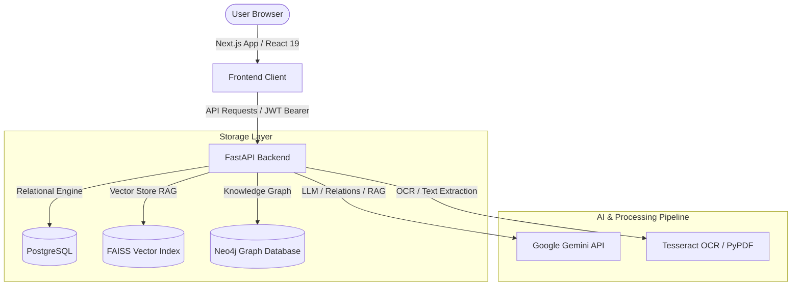

# IndusMind AI — Industrial Knowledge Platform

IndusMind AI is an industrial-grade operational knowledge workspace designed to consolidate safety logs, SOP requirements, machine logs, and regulatory compliance factory acts into a unified, secure knowledge graph intelligence portal.

---

## 🏗️ Project Architecture



### 1. High-Fidelity Frontend UI & UX (Next.js 16)
- **Interactive 3D Geometric Graph Mesh**: A lightweight particle node-and-line graph rendered with CSS 3D transforms. Sweeping the cursor over the left panel calculates parallax shifts (`rotateX` / `rotateY`) on-the-fly, running with GPU-accelerated `will-change: transform`.
- **Connected Node Feature Deck**: A stacked set of 4 interactive cards. The active card displays a horizontal progress sweep loader cycling every 4 seconds, while inactive cards scale down and apply soft blurs.
- **Glassmorphic Depth of Field Form Card**: Uses layered border glare gradient animations, deep shadows, and subtle inner grids that fade in on hover.
- **Liquid tab switcher**: Sign In/Register tabs switch positions horizontally using custom cubic-bezier animations.
- **Tactile Inputs**: Micro-icons (Mail, Lock, User) zoom via spring scales on input focus alongside cobalt outer glow rings.
- **Mock Telemetry authorization widget**: A clean monospace credentials alert module matching the white form card theme.

### 2. Relational & Graph Database Services (FastAPI Backend)
- **Relational Storage (PostgreSQL)**: Manages documents registries, metadata, users session schemas, and compiled report listings. Includes SQLite fallback for offline local runs.
- **Vector Search RAG (FAISS)**: Chunk and index ingested SOP documents to serve prompt context during safety log audits. Relational indexes are reconciled with database records on startup to avoid orphaned chunks.
- **Knowledge Graph (Neo4j)**: Maps relation links between plant entities (SOP directives, machine units, corrective actions). Graph DB runs in a light mock state in-memory during local development if Neo4j is offline.

---

## 🛠️ Tech Stack

### Backend
- **Framework:** FastAPI
- **Relational DB:** PostgreSQL (via SQLAlchemy & `pg8000`)
- **Graph DB:** Neo4j Community (with `APOC` plugins)
- **Vector DB:** FAISS (`faiss-cpu`)
- **Ingestion & OCR:** PyMuPDF, PyPDF, PyTesseract OCR, Pillow
- **AI Stack:** Google Generative AI (`gemini-2.0`), LangChain, LangGraph

### Frontend
- **Framework:** Next.js 16 (App Router)
- **Language:** React 19 / TypeScript 5
- **Styling:** Tailwind CSS 4, Radix UI Primitives
- **Graphics:** ReactFlow (for visual topology navigation)

---

## 🚀 Getting Started

### Prerequisites
Make sure you have the following installed on your machine:
- **Docker & Docker Compose**
- **Python 3.10+** (with `pip` and `virtualenv`)
- **Node.js 18+** (with `npm`)
- **Tesseract OCR Engine** (required for paper document scanning)

---

### 1. Launching Databases with Docker
Run the following command at the root directory to spin up the local PostgreSQL database and Neo4j graph instances:
```bash
docker-compose up -d
```
- **PostgreSQL:** Port `5433` (Database name: `indusMind`)
- **Neo4j Browser:** Port `7474` (Bolt port: `7687`, auth: `neo4j/<your_password>`)

---

### 2. Setting Up Backend Config
1. Navigate into the `backend/` directory:
   ```bash
   cd backend
   ```
2. Create a `.env` file from the configuration structure:
   ```env
   DATABASE_URL=postgresql+pg8000://<postgres_user>:<postgres_password>@localhost:5433/indusMind
   NEO4J_URI=bolt://localhost:7687
   NEO4J_USER=neo4j
   NEO4J_PASSWORD=<your_neo4j_password>
   GEMINI_API_KEY=your_gemini_api_key_here
   ALLOW_SQLITE_FALLBACK=False
   ```
3. Initialize the virtual environment and install packages:
   ```bash
   python -m venv venv
   # On Windows:
   venv\Scripts\activate
   # On macOS/Linux:
   source venv/bin/activate

   pip install -r requirements.txt
   ```
4. Run the FastAPI development server:
   ```bash
   uvicorn app.main:app --reload --port 8000
   ```
   The backend API will run at [http://localhost:8000](http://localhost:8000). Interactive Swagger docs are available at [http://localhost:8000/docs](http://localhost:8000/docs).

---

### 3. Setting Up Frontend Next.js Client
1. Navigate into the `frontend/` directory:
   ```bash
   cd ../frontend
   ```
2. Install npm dependencies:
   ```bash
   npm install
   ```
3. Start the Next.js local development server:
   ```bash
   npm run dev
   ```
   Open [http://localhost:3000](http://localhost:3000) in your browser.

---

## 📁 Repository Directory Structure

```text
IndusMind-AI/
├── backend/
│   ├── app/
│   │   ├── api/          # Routers (Auth, Documents, Chat, Graph, Compliance, Reports)
│   │   ├── core/         # Settings configuration, security helpers
│   │   ├── db/           # Session context and databases seed initialization
│   │   ├── models/       # Relational models (User, Document, Report, Asset)
│   │   ├── schemas/      # Pydantic payloads validation
│   │   ├── services/     # Graph queries, Vector stores index, PDF compilers
│   │   └── main.py       # FastAPI entrance script & startup reconciling
│   ├── requirements.txt  # Python packages
│   └── .env              # Backend secrets
├── frontend/
│   ├── src/
│   │   ├── app/          # Next.js pages (Chat, Compliance, Graph, Dashboard)
│   │   ├── components/   # Collapsible sidebar, loader animations, Copilot panels
│   │   ├── context/      # Session AuthContext & state tracking
│   │   └── lib/          # API hooks for axios/fetch request calls
│   ├── package.json      # Frontend package configuration
│   └── tailwind.config.js
└── docker-compose.yml    # Postgres & Neo4j database containers
```

---

## 🔐 Credentials Checklist for Demo
- **Demo Username:** `admin@industrial.ai`
- **Demo Password:** `adminpassword123`
- Database tables and the seed admin account are initialized automatically during backend server startup.
